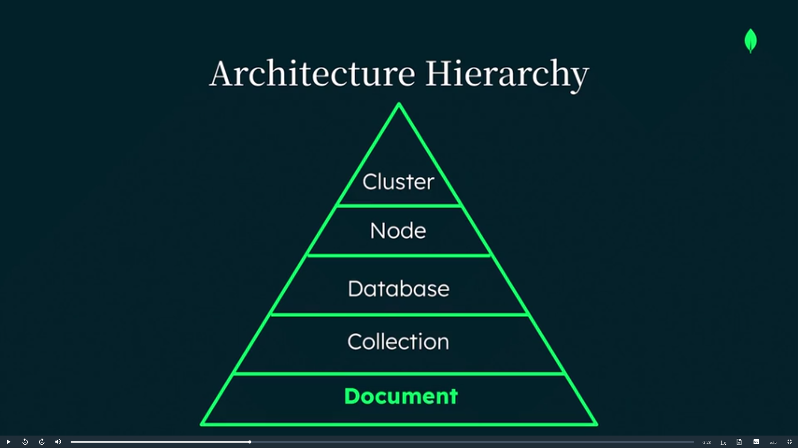

# MongoDB Document Model & Flexible Schema

## What is a Document Database?

MongoDB is a **document database**.

It stores data in the form of **documents** instead of tables and rows.

A document represents one object, such as:

* User
* Product
* Blog post

---

# MongoDB Document Model

A document contains information about one object.

Example fields:

* Name
* Title
* Interests
* Address

MongoDB automatically adds a unique `_id` field to every document.

Purpose of `_id`:

* Uniquely identifies each document
* Helps in:

  * Fast retrieval
  * Updating
  * Deleting data

---

# MongoDB Data Structure

MongoDB uses a simple hierarchy:

## 1. Document

Smallest unit of data.

## 2. Collection

A group of documents.

Example:

* Users collection
* Products collection

## 3. Database

A group of collections.

---

# Flexible Schema

One of MongoDB’s biggest features is its **flexible schema**.

This means:

* Documents in the same collection can have different structures.
* Different fields and data types are allowed.

This is called:

## Polymorphic Data

---

# Example: Social Media App

A single `posts` collection can store different types of posts.

## Common Fields

All posts may contain:

* ID
* Timestamp
* Links

---

## Text Post

Fields:

* Content

---

## Photo Post

Fields:

* Photo URL
* Caption

---

## Video Post

Fields:

* Video URL
* Title
* Duration

---

# Main Benefit

All these different post types can exist in the same collection.

No need for:

* Multiple tables
* Complex schemas
* Difficult migrations

This makes development:

* Faster
* Easier
* More flexible

---

# Easy Feature Expansion

If a new feature is added, like:

* Live stream posts

You can simply create a new document structure in the same collection.

No major database redesign is needed.

---

# Best Use Cases of MongoDB

MongoDB works very well for:

* Social media apps
* IoT applications
* Mobile apps
* Gaming
* Content management systems

Especially useful for:

* Unstructured data
* Semi-structured data
* Rapidly changing applications

---

# MongoDB and Generative AI

MongoDB is also useful for AI applications.

It can store:

* Unstructured data
* Vector embeddings

## Vector Embeddings

Numerical representations of data used for:

* Semantic search
* AI-powered features

This helps developers build AI applications more easily.

---

# Important Points

## MongoDB Advantages

* Flexible schema
* Easy data management
* Supports different data structures
* Fast development
* Easy feature expansion
* Good for modern applications
* AI-friendly database

# Architecture / Data Model Image

