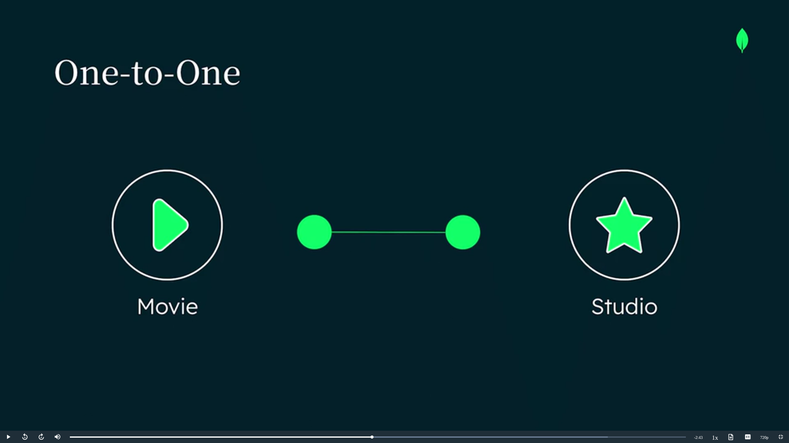
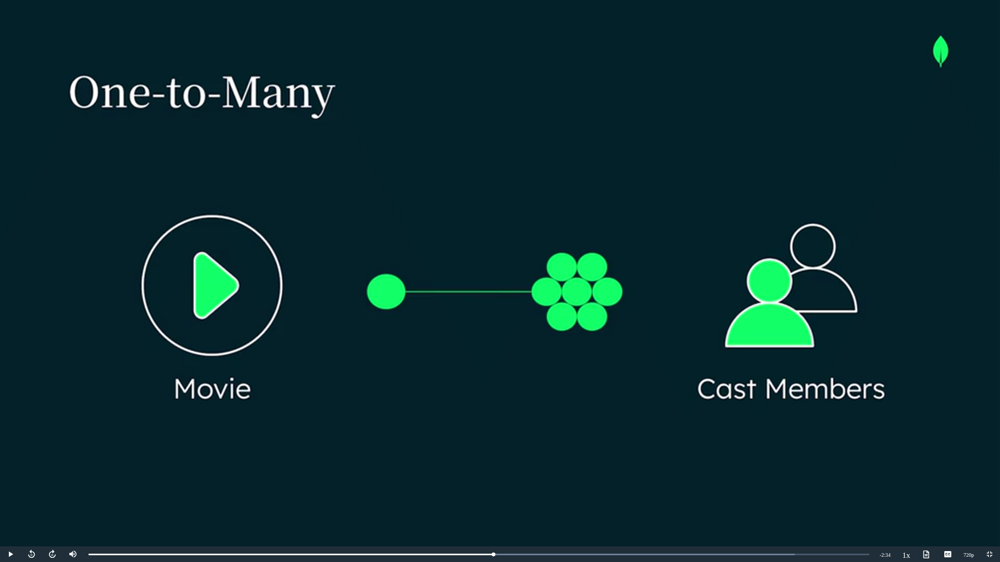
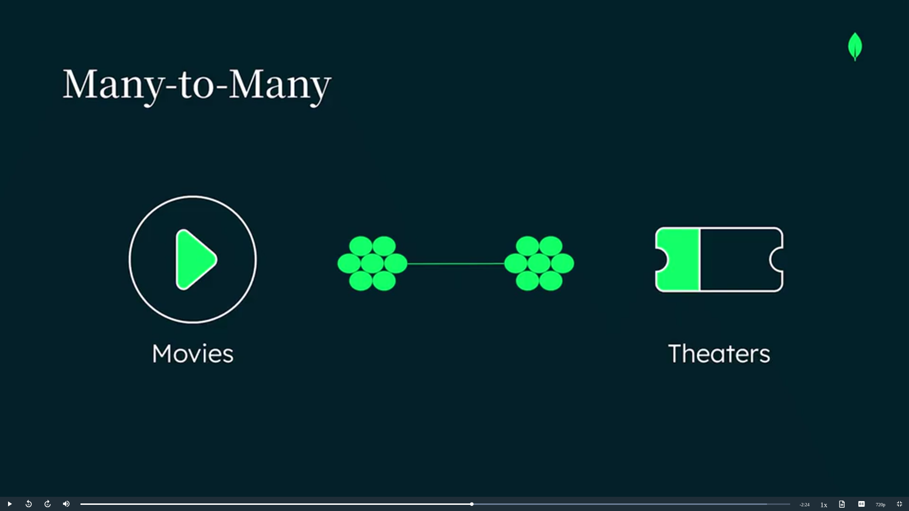

# MongoDB Data Modeling (Simple Summary)

## Main Idea of MongoDB Data Modeling

### Important Rule

> Data accessed together should be stored together.

This helps:

* Faster queries
* Better performance
* Easier application design

---

# Entities and Attributes

## Entity

An entity is an object in the application.

Examples:

* User
* Movie
* Product
* Comment

In MongoDB:

* Entities are stored as **documents**
* Documents are grouped into **collections**

### Example Collections

* Movies
* Users
* Comments

---

## Attribute

Attributes describe an entity.

### Movie Attributes Example

* Title
* Genre
* Rating

In MongoDB:

* Attributes are stored as **field-value pairs**

Attributes can also be:

* Nested objects
* Sub-documents

Example:

* Cast members inside a movie document

---

# Types of Relationships

MongoDB supports 3 main relationship types.

---

# 1. One-to-One Relationship

One entity is connected to only one other entity.

### Example

* One Movie → One Studio

## Diagram

---

# 2. One-to-Many Relationship

One entity is connected to many other entities.

### Example

* One Movie → Many Cast Members

## Diagram

---

# 3. Many-to-Many Relationship

Many entities are connected to many other entities.

### Example

* Many Movies ↔ Many Theaters

## Diagram

---

# Two Data Modeling Approaches

MongoDB provides two ways to model relationships.

---

# 1. Embedding

Store related data inside the same document.

### Example

Movie document contains:

* Movie info
* Cast array

## Best When

* Data is accessed together
* Fast reads are needed
* Atomic operations are important

## Benefits

* Faster queries
* Fewer database operations
* Better performance

---

# 2. Referencing

Store related data in separate documents using IDs.

Similar to:

* Foreign keys in relational databases

### Example

Movie document stores:

* Actor IDs

Actor information stays in:

* Separate actor documents

## Best When

* Data is accessed independently
* Data grows very large
* Separate pages are needed

---

# How to Choose?

## Use Embedding When

* Data is always used together
* Example:

  * Movie page with cast list

---

## Use Referencing When

* Data is used separately
* Example:

  * Separate pages for actors and movies

---

# Important Considerations

## Embedding Problems

Large arrays or documents can:

* Increase size
* Reduce performance

---

## Referencing Problems

Requires:

* Multiple queries
* Lookup operations

This may cause:

* Extra latency

---

# Schema Design Patterns

MongoDB also supports schema design patterns.

These help:

* Optimize storage
* Improve query performance
* Handle workload requirements

---

# Important Points

## MongoDB Data Modeling Advantages

* Flexible schema
* Easy relationship handling
* Faster development
* Better performance
* Supports complex applications
* Easy to scale

---

# Final Conclusion

MongoDB data modeling focuses on:

* Application access patterns
* Flexible relationships
* Efficient data storage

The two main approaches are:

* Embedding
* Referencing

Choosing the right approach depends on:

* How data is accessed
* Data size
* Performance needs
