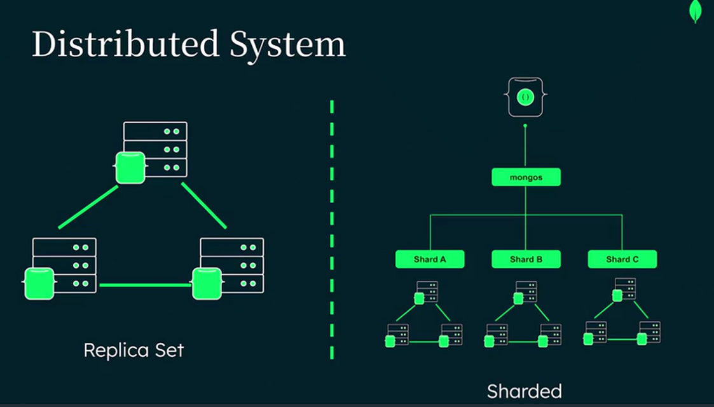
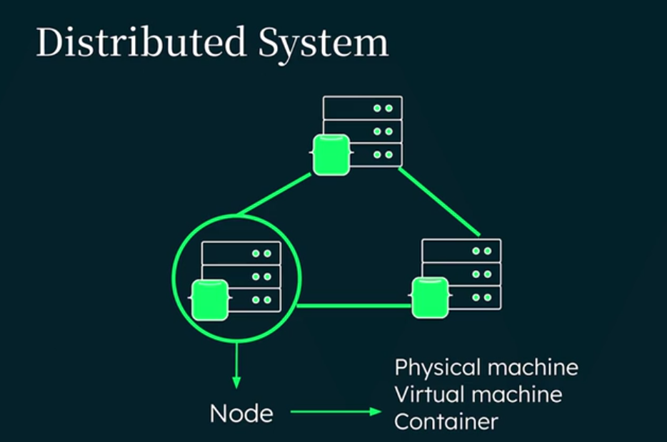
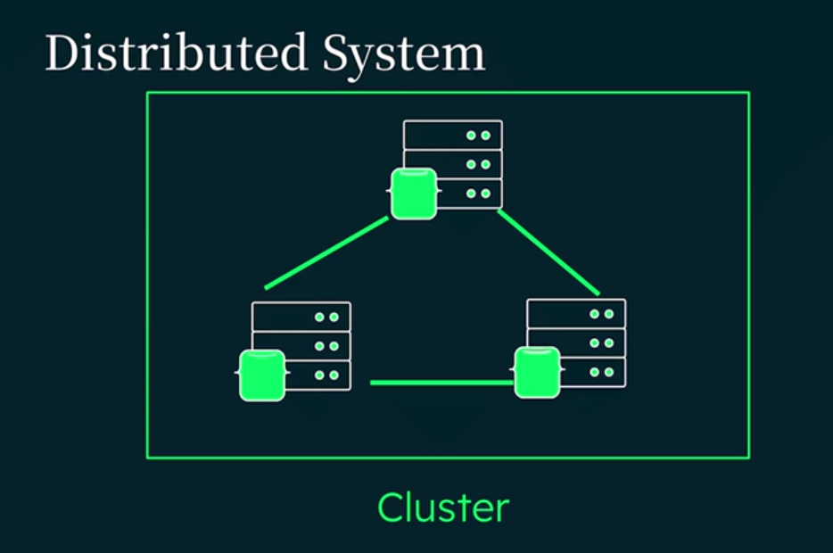
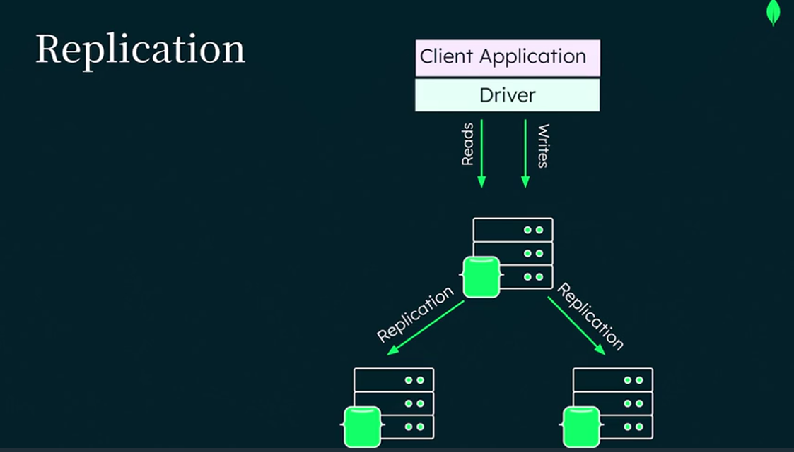
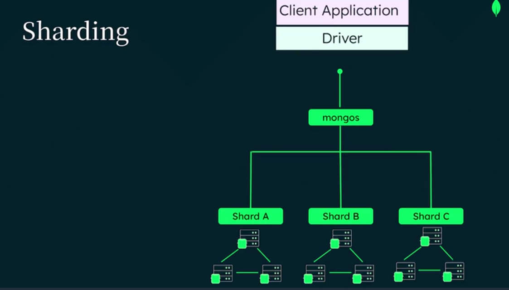

# MongoDB Architecture & Distributed System 

## MongoDB Architecture Overview

MongoDB is designed for:

* Flexibility
* Scalability
* High performance

It uses a distributed system architecture to handle:

* Large datasets
* High traffic
* Modern applications

---

# MongoDB Data Hierarchy

MongoDB organizes data in this order:

## 1. Document

Smallest unit of data.

Stores:

* Object information
* Metadata
* Field-value pairs

Data types can include:

* Strings
* Numbers
* Dates
* Arrays
* Objects

---

## 2. Collection

A collection is a group of documents.

Usually represents:

* Users
* Products
* Movies

---

## 3. Database

A database contains multiple collections.

---

# MongoDB Architecture Diagram

---

# Distributed System

MongoDB works as a **distributed system**.

This means:

* Data is stored across multiple servers
* Servers may exist in different locations

Benefits:

* High availability
* Better scalability
* Fault tolerance

---

# Node

A node is a single MongoDB instance.

It can run on:

* Physical machine
* Virtual machine
* Container

## Node Diagram

---

# Cluster

A cluster is a group of MongoDB nodes.

MongoDB mainly uses:

* Replica Sets
* Sharded Clusters

## Cluster Diagram

---

# Replica Sets & Replication

## Replication

Replication means:

* Keeping multiple copies of data
* Synchronizing data across nodes

Purpose:

* High availability
* Data redundancy
* Reliability

If one node fails:

* Other nodes continue working

This keeps the application online.

## Replication Diagram

---

# Sharding

## What is Sharding?

Sharding splits data across multiple servers.

Purpose:

* Horizontal scaling
* Better performance
* Handling massive datasets

MongoDB distributes data using:

* Shard Keys

Each shard usually works as:

* Its own replica set

Applications connect using:

* MongoS query router

MongoS automatically sends queries to the correct shard.

## Sharding Diagram

---

# Important Note About Sharding

Sharding is powerful but:

* Adds deployment complexity
* Requires careful planning
* Is not always necessary

Usually used for:

* Very large applications
* Huge datasets
* High traffic systems

---

# MongoDB for AI Applications

MongoDB also supports AI workloads.

It can store:

* Vector embeddings
* Unstructured data

## Vector Embeddings

Numerical representations of data used for:

* Semantic search
* AI recommendations
* Smart search systems

This helps build:

* Intelligent applications
* AI-powered features

---

# MongoDB Deployment Options

MongoDB provides 3 deployment choices.

---

# 1. MongoDB Atlas

## MongoDB Atlas

[MongoDB Atlas](https://www.mongodb.com/atlas?utm_source=chatgpt.com)

Cloud-based managed database service.

Features:

* Automatic deployment
* Auto scaling
* Monitoring
* Backups
* Security

Best for:

* Modern cloud applications
* Easy management

---

# 2. MongoDB Community Server

## MongoDB Community Server

[MongoDB Community Server](https://www.mongodb.com/try/download/community?utm_source=chatgpt.com)

Free self-managed version.

Best for:

* Learning
* Development
* Small projects

Features:

* Core MongoDB tools
* Atlas Search
* Vector Search

---

# 3. MongoDB Enterprise Advanced

## MongoDB Enterprise Advanced

[MongoDB Enterprise Advanced](https://www.mongodb.com/products/platform/enterprise-advanced?utm_source=chatgpt.com)

Paid enterprise version.

Extra features:

* Advanced security
* Enterprise support
* Management tools
* Compliance support

Best for:

* Large companies
* Mission-critical applications

---

# Infrastructure Support

MongoDB also supports:

* Terraform
* Kubernetes
* CloudFormation

This helps automate deployment and infrastructure management.

---

# Important Points

## MongoDB Architecture Benefits

* Distributed system support
* High availability
* Horizontal scaling
* Fault tolerance
* AI-ready architecture
* Cloud support
* Flexible deployment options

---

# Final Conclusion

MongoDB architecture is built for:

* Modern scalable applications
* High availability systems
* Large datasets
* AI-powered workloads

Main technologies used:

* Replication → Reliability
* Sharding → Scalability

MongoDB provides both:

* Self-managed solutions
* Fully managed cloud solutions
